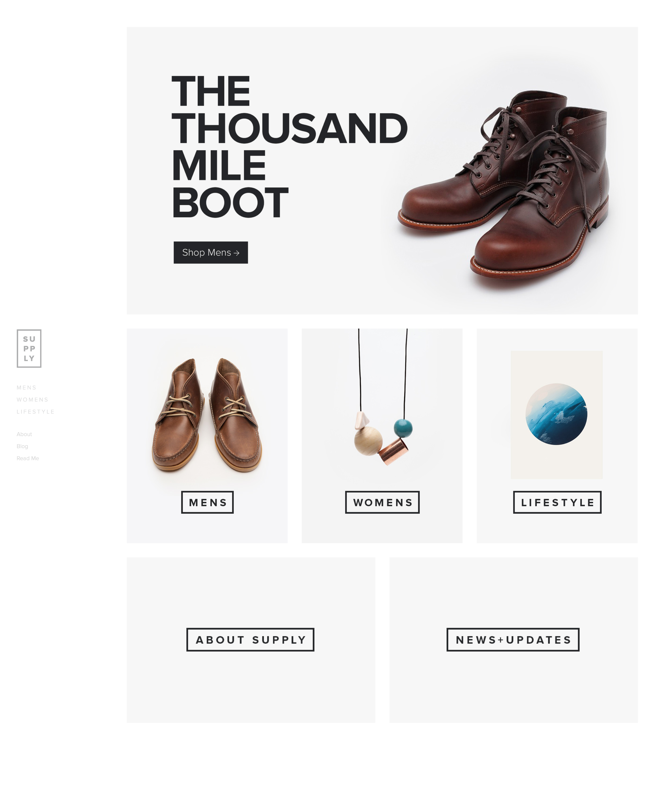

---
Title: Mockup - Supply 
Type: Morning Exercise  
Duration: "0:45" 
Original creators: WDI-Archer, WDI-Funke, WDI-Panthalassa 
Adapted by: Kristyn Bryan, Karolin Rafalski       Competencies: Basic HTML & CSS blocks, Flexbox 
Prerequisites: CSS, HTML  

---

## Setup
1. `git pull upstream master` to get this morning's starter code. 
2. Inside of todays morning_exercise folder, create a folder called `supply` 
3. Inside your new `supply` folder, create an `index.html` file. 
4. Inside your `supply` folder, create a `style.css` file. 
5. Add the boilerplate to your html file. 
6. Connect your CSS file to your HTML file and make sure that it is attached (hint: give the body a background color temporarily) 
7. NOTE: All images you'll need to recreate the mockup are provided for you in the `img` folder

Before diving in: Review what wireframing is and how to use it for building a layout with HTML and CSS.

1. [Guide to Wireframes](https://webdesign.tutsplus.com/articles/a-beginners-guide-to-wireframing--webdesign-7399)
2. [Example video of Karolin wireframing the supply mockup](https://youtu.be/fixtY24nzSg)
3. [Example image of wireframing the supply mockup by hand](https://imgur.com/N611F5d.png)

## Flexbox Resources:
[A Complete Guide to Flexbox (CSS Tricks](https://css-tricks.com/snippets/css/a-guide-to-flexbox/))  
[Equidistance Spacing- examples of failed attempts and wins](https://css-tricks.com/equidistant-objects-with-css/)
