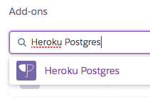
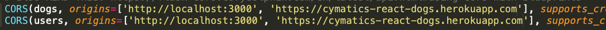

# Flask + React heroku deployment

Adapted by Reuben Ayres from Flask Deployment instructions by Jim Haff

## Caution

Read this carefully and make sure you're doing exactly what it says.  If you're not clear on why you're doing a certain step, ask your instructors.  Deployment is notoriously difficult.  Systems and requirements and processes and services and preferred configurations change _all the time_, and a process that you may be accustomed to, such as this, can suddenly become outdated.  It is important to understand what needs to happen for an app to be deployed and why you're doing the things you're doing.  It's also important to get comfortable reading documentation and discussion online about deployment, and connect steps you're taking to that documentation.  Expect to spend time having to do research in general when you deploy apps after this course, as you will almost definitely not be able deploy by memorizing a set of steps. For today, do not just skim this and paste the commands, as you may miss an important detail. 

## Prerequisites

* **:red_circle: :red_circle: CRITICAL: :red_circle: :red_circle: Both apps must be working locally without errors.**

* **:red_circle: :red_circle: CRITICAL: :red_circle: :red_circle: Both apps must be in the `master` branch.**

* **:red_circle: :red_circle: CRITICAL: :red_circle: :red_circle: The code for your app (i.e. package.json for React and requirements.txt for Python) should be at the top level of your repo.  Your code should not be all in a folder inside your repo.**

## Set up a Heroku-friendly WSGI Server for the Flask app

Perhaps you've noticed when you start your Flask API with `python app.py` or `python3 app.py`, you see this message: 

We're going to follow their suggestion and configure a [WSGI (a standard for building web servers in python, used by many python framworks)](https://www.google.com/search?q=wsgi+server&oq=wsgi&aqs=chrome.0.69i59j69i57j0l3j69i60l3.746j1j4&sourceid=chrome&ie=UTF-8) server. 

* **Make sure you are in your virtual environment**

* `pip install gunicorn` -- this is a [web server for running Python apps in production](https://gunicorn.org/) because, as we just mentioned above, the "web server" that comes with Flask (that we've been starting with `app.run()` in our code) is really only intended to be used for development ([read this for more if you're interested](https://vsupalov.com/what-is-gunicorn/)). 

* `pip freeze > requirements.txt` -- so that `gunicorn` is included with your project.

* `touch Procfile` [This is how we explicitly tell Heroku exactly how to run our app so it doesn't have to guess](https://devcenter.heroku.com/articles/procfile)

* Edit `Procfile` to include the following: `web: gunicorn app:app`

## Install the postgres driver if you haven't already

Since you don't need it to use Sqlite, you may not have installed the driver that Peewee needs to connect to postgres. 

Make sure you're in your virtual environment, and then install it now:
```bash
(.env) $ pip install psycopg2
```

If that fails, try: `(.env) $ pip install psycopg2-binary`

Once it installs, remember to `pip freeze > requirements.txt`.

## Let's be nice and make our Flask app not hog up the connection pool

We're about to configure our app to use a deployed PostgreSQL database server that many people can acecss instead of a `.sqlite` file on our computers that only we are accessing.  Typically when a database server is used, it's not desirable to allow a connection to remain open for each user.  To manage the load on the database and keep access fast, a ["connection pool"](https://en.wikipedia.org/wiki/Connection_pool) is often used used to manage these connections.  

We are going to use [some configurable callbacks in Flask](https://flask.palletsprojects.com/en/1.1.x/reqcontext/#callbacks-and-errors) (see also [here (before)](https://flask.palletsprojects.com/en/1.1.x/api/#flask.Flask.before_request) and [here (after)](https://flask.palletsprojects.com/en/1.1.x/api/#flask.Flask.after_request)) and also [here](https://flask.palletsprojects.com/en/1.1.x/patterns/deferredcallbacks/) and here:) and to open our database connection before each request, and close it after each request, so as not to hog our connection from the connection pool.

In `app.py`, at the top, add [`g`](https://flask.palletsprojects.com/en/1.1.x/api/#flask.g) ([and also see here for more info about `g`](https://flask.palletsprojects.com/en/1.1.x/appcontext/)) to the list of things you are importing from Flask:

```python
from flask import Flask, jsonify, g
# g lets us use global variables for the life of (i.e. in the context of) this 
# particular execution of this app (similar to app.locals in express)
```

And also in `app.py`, after your blueprints:

```python
# we don't want to hog up the SQL connection pool
# so we should connect to the DB before every request
# and close the db connection after every request

@app.before_request # use this decorator to cause a function to run before reqs
def before_request():
  """Connect to the db before each request"""
  # store the database as a global var in g
  print("you should see this before each request") # optional -- to illustrate that this code rus before each request -- similar to custom middleware in express.  you could also set it up for specific blueprints only.
  g.db = models.DATABASE
  g.db.connect()


@app.after_request # use this decorator to cause a function to run after reqs
def after_request(response):
  """Close the db connetion after each request"""
  print("you should see this after each request") # optional -- to illustrate that this code runs after each request
  g.db.close()
  return response # go ahead and send response back to client 
                  # (in our case this will be some JSON)
```

On your machine, your app should still run as normal, and you can test that with React and Postman.


## "Create" the app on heroku for Flask

* **Read this entire bullet before you type anything**. You need somewhere for your app to live on heroku.  We will do this with the `heroku create` command provided by the CLI.  If you have an app name you want in your URL, you can include it with `heroku create`, but if you don't a name (like polar-glacier-23616 or some such) will be automatically generated for you.  So if you wanted your coin collecting app to be at `https://numismania-app.herokuapp.com` then you would type `heroku create numismania-app`.  Or if you don't care what the URL of your app is, just type `heroku create` and a name will be created for you. 

* Running `heroku create` added a spot on heroku for your app to live, and also added it as a remote.  Check this by running `git remote -v` on your terminal. 

* Now we need to set up a PSQL database on Heroku for your heroku app. Go to your heroku dashboard. You should see your app in the list of apps. Click on it.  Then click on the Resources tab.  Under Add-ons, in the search field, type "Heroku Postgres", and choose it from the list when it pops up.  
  
  It may pop up a window confirming you want to add Heroku Postgres to your app, and you do, so click "Provision" and you might see a message like: `The add-on heroku-postgresql has been installed.....`

* Next, click on the Settings tab, and then on Config Vars. Click Reveal Config Vars.  Remember from unit 2: these are the environment variables for your app on heroku.  You will see that it has added an environment variable for you called `DATABASE_URL`.  Sweet.  We'll need that for the next step, so leave this window open.

* While we're here, let's also set an env var that we can use in our code (in the next step) to see if we are in production (i.e. app is running on heroku) or development (i.e. app is running on your computer).  Add another environment variable called `ON_HEROKU`. Give it a value of `1`, then click Add.


## Make the Flask app connect to local db in development, or the Heroku postgres DB in production

Now, when our Flask app is running on heroku, there will be an environment variable set called `ON_HEROKU`.  So we'll program our app to look for it, and if it's there we'll use the `DATABASE_URL` heroku just gave us, and if it's not we'll continue to use our Sqlite database. 

* At top of `models.py`, add: 
  ```py
  import os
  ```
  This is a [python module for interacting with our operating system](https://docs.python.org/3/library/os.html).


* In `models.py`, after your other imports, add: 
  ```py
  from playhouse.db_url import connect
  ```
  This is [a Peewee extension for creating a database connection from a URL string](http://docs.peewee-orm.com/en/latest/peewee/playhouse.html#database-url).


* Then in `models.py`, before your first model definition, change your database connection code to conditionally connect to either the Heroku PostgreSQL database we just provisioned, or your local database as you previously were. This will probably amount to replacing something this:
  ```py
  DATABASE = SqliteDatabase('dogs.sqlite')
  ```
with something like this:
  ```py
  if 'ON_HEROKU' in os.environ: # later we will manually add this env var 
                                # in heroku so we can write this code
    DATABASE = connect(os.environ.get('DATABASE_URL')) # heroku will add this 
                                                       # env var for you 
                                                       # when you provision the
                                                       # Heroku Postgres Add-on
  else:
    DATABASE = SqliteDatabase('dogs.sqlite')
  ```

### ...Make sure it's creating the tables in deployment too...

In `app.py`, when the app is run, it creates the tables (`models.initialize()`).  We need to make sure this is also happening in the deployed app as well!

* In `app.py`, at the top, add: 
  ```py
  import os
  ```

* Again, when we're in production we'll see that environment variable we just set in heroku will be viewable, so we need to initialize the models in that case as well (`app.py`, at the bottom): 
  ```py
  # ADD THESE THREE LINES -- because we need to initialize the
  # tables in production too!
  if 'ON_HEROKU' in os.environ: 
    print('\non heroku!')
    models.initialize()

  # you should already have these lines at the bottom of your app
  # this is how the app is run when you type "python app.py" on your terminal
  # running a .py file from the terminal causes __name__ to be set to __main__
  # inside that application
  if __name__ == '__main__': 
    models.initialize() 
    app.run(debug=DEBUG, port=PORT)
  ```


* Now your Flask app is ready for deployment.  **Add and commit.** 


## Push to deploy Flask

* Sweet!  Now you're ready to actually deploy your Flask app. Recall from Unit 2 that you typically deploy heroku apps by pushing, so go to your terminal and run `git push heroku master` and **read all the output** as it downloads the modules and sets up your app.  _Keep an eye out for your URL._  If your deployment is successful, you'll see it near the end of the output in lines like this: 
  ```
  ...
  remote: -----> Launching...
  remote:        Released v9
  remote:        https://polar-garden-62292.herokuapp.com/ deployed to Heroku
  ...
  ```
  Note: it's **not** the one after that that ends in `.git`. 

* **When it's done, open up Postman and test all your routes (use the above URL, and add on the `/api/v1/users/register` or whatever) and make sure they all work as expected.**

* If there are errors, you can see them with `heroku logs` or `heroku logs --tail`.  You'll have to fix them, and then add, commit, and push again.  Once you get them all debugged, your API should be working correctly _in Postman_.

* If you'd like to interact directly with your heroku Postgres database, you can access the CLI by running `heroku pg:psql` in your terminal. 


## Deploy and configure the React App

As of 2019, the [proper procedure for deploying a React app made with `create-react-app` to Heroku](https://elements.heroku.com/buildpacks/mars/create-react-app-buildpack) is to use the `mars/create-react-app` buildpack. Here's how. 

### Create the React app on Heroku.

* Go to your React app's directory in your terminal. 

* Create your app dyno on heroku: **BE sure you set the buildpack, and replace YOUR_APP_NAME with the name you want for your app**: 
  ```bash
  $ heroku create YOUR_APP_NAME --buildpack mars/create-react-app
  ```
  **If you forget the buildpack: 1) go to the heroku dashboard and delete the react app, and 2) run `git remote remove heroku` in your terminal, and repeat the above steps.**  

* Again, observe that `heroku create...` adds a remote (i.e. run: `git remote -v`).


### Add the URL for your deployed Flask API to the heroku deployment environment of your React App

You've already got your app configured to use an environment variable to for your API URL (something like `REACT_APP_API_URL` in your `.env`) when it's running on your computer.  But remember your environment variables are (or should be!!) gitignored and heroku will read the environment variables from the settings you configure on the heroku website.  So you need to provide the Heroku-deployed app with the corresponding information.

* Find the URL of your deployed Flask API and copy it to your clipboard.

* Go to your heroku dashboard and click on your React app.  Open Config Vars (environment variables) in your React App settings on Heroku.  Add a key `REACT_APP_API_URL` (or whatever key you used in your `.env` on your computer). For the value, paste the URL of your deployed flask API. Click Add. **_Be careful with the slashes—if you're following the example from class, there should be no slash at the end_.**

* >Note: If you have any other React environment variables, such as API keys, add those now as well.

### Push to deploy React

* Deploy your React app to heroku: `git push heroku master`.  Note we didn't need to add or commit, because we didn't change any of the React code.  As before, READ ALL OF THE OUTPUT!!! 

  <details>
    <summary>
    You might get an error like this about `yarn.lock` and `package-json.lock`.  (Click the arrow to the left to see it.)  That's okay, it's because of the way create-react-app installs stuff.  Yarn is facebook's version of npm.  If you get the error, again, _it's okay._  Just follow the instructions to fix it (in class we used npm, so we suggest following that path).  Don't forget to add and commit after following them.
    </summary>

    ```
    ...
    remote: -----> Build failed
    remote:  !     Two different lockfiles found: package-lock.json and yarn.lock
    remote: 
    remote:        Both npm and yarn have created lockfiles for this application,
    remote:        but only one can be used to install dependencies. Installing
    remote:        dependencies using the wrong package manager can result in missing
    remote:        packages or subtle bugs in production.
    remote: 
    remote:        - To use npm to install your application's dependencies please delete
    remote:          the yarn.lock file.
    remote: 
    remote:          $ git rm yarn.lock
    remote: 
    remote:        - To use yarn to install your application's dependences please delete
    remote:          the package-lock.json file.
    remote: 
    remote:          $ git rm package-lock.json
    remote:     
    remote:        https://help.heroku.com/0KU2EM53
    remote: 
    remote:  !     Push rejected, failed to compile React.js (create-react-app) multi app.
    remote: 
    remote:  !     Push failed
    remote: Verifying deploy...
    remote: 
    remote: ! Push rejected to cymatics-react-dogs.
    remote: 
    To https://git.heroku.com/cymatics-react-dogs.git
     ! [remote rejected] master -> master (pre-receive hook declined)
    error: failed to push some refs to 'https://git.heroku.com/cymatics-react-dogs.git'

    ```
  </details>

* Once you get it pushed/deployed successfully, again, keep an eye out for the URL.  You will need it for the next step.  Copy it to your clipboard.

* :red_circle: Note: Your React app will not be able to access your API yet! There's one more very important step!:red_circle:


## Back to Flask: Adjust your CORS configuration in Flask to allow your React App as an Origin

* In `app.py`, where you're applying CORS to your blueprints, add paste the deployed React App's URL that you just copied into the list (which now only includes `http://localhost:3000`).

  

  :red_circle: Again: **be careful with your slashes.** If your `http://localhost:3000` doesn't have a slash at the end (i.e. if you're following the examples from class), than your deployed React link shouldn't either. 

* Add, commit, and push your Flask app to heroku once more!

## That's it!

Open up your deployed React app (fun fact, you can just type `heroku open` in the terminal where you're in your React app repo), and make sure everything works!  If you're getting wicked CORS errors and everything was working locally, triple check that all your slashes on your URLs are correct.  Note: If you're following the examples from class, you should not need to edit the React code at all. 


## Notes about debugging and troubleshooting

You've probably never done this before, and it's very normal and _okay_ if you accidentally made a typo or a mistake somewhere.  

If you have any deployment errors, try to solve any deployment errors yourself using the logs, google, and reading back over this to make sure you followed it closely.  

This program will be over in a couple of weeks so it's critical to be building building that independent debugging skill.  As you now know, a LOT of coding is finding and fixing errors.  If you do get totally stuck and need to ask for help, you should be prepared to show what you've researched, what you envision the issue to be, and the things you've tried to fix it. 

