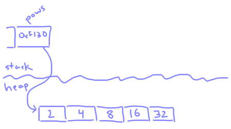

# Computer Memory

## Learning Objectives

* Define computer memory
* See how memory is used via the stack and the heap
* Discuss strategies for avoiding memory leaks
* Visualize memory usage in Javascript with the Chrome developer tools

## Prerequisites

* Basic programming in C
* Basic programming in Javascript

## What is Memory? (0:05)

If you've ever shopped around for a laptop, you probably saw several different laptop specifications: hard drive space, memory, CPU speed, etc.

CPU speed and hard drive space may be intuitive to understand. CPU speed affects how fast your computer runs. This essentially determines how many lines of code your computer is capable of running in a given amount of time.

Hard drive space is generally well understood as well. Whenever you add, create or copy files on your computer, those files are taking up space on the hard drive. When you delete files, you free up space on the hard drive. The hard drive is persistent; when you turn off your computer, your files will still be there when you turn it back on.

Memory is a little more mysterious. But essentially, it's space in your computer that is used by currently-running programs. Whenever you define a variable, append values to an array, or define new properties on an object, you're using this space. It's not persistent and requires a power source, so when you turn off your computer all programs have to stop running. That's why putting your computer in "sleep" mode can keep programs running -- power is still being used to persist program state in memory.

The more memory your computer has, the more programs you can run simultaneously without slowing down your computer, since every program is using some amount of memory. So for example a computer with 16 GB of memory is likely to be able to have many more Chrome tabs open than a computer with 4 GB of memory.

If you try to create a very large array in Javascript, your program may crash and tell you it ran out of memory. If you watch your task manager while this is happening you will probably see your memory usage spike.

## The Stack (0:20)

In discussing how specifically memory is used by programs, we'll start by describing the **stack**.

When you declare variables in C, you are allocating a certain amount of data in memory for those variables. For example, the following code:

```c
    int myNum1 = 5;
    int myNum2 = 42;
```

allocates 64 bits in memory, 32 bits per `int`:


When you make a function call, the parameters you pass also go on the stack, along with an empty space for the return value. If the function you called allocates local variables, those go on the stack too. The new space for these parameters and local variable are called a **stack frame** for this function.

```c
// Acts like the ** operator in Javascript
int pow(int a, int b) {
    int p = 1;
    for (int i = 0; i < b; i++) {
        p *= a;
    }
    return p;
}

...

    int myNum1 = 5;
    int myNum2 = 42;
    int twoCubed = pow(2, 3);
```


When the called function returns, you pop everything from its scope off the stack. That's why you can no longer access those local variables outside of the function! And you need to store the returned value somewhere if you need it, because it's also getting popped off the stack.


> Note: This visualization of the stack simplifies things a bit. In reality, your program will also store where in code to return to after the function returns, and where on the stack the last stack frame starts.

### Arrays and Strings on the Stack

Arrays and strings store multiple adjacent values on the stack:

```c
    int myArr[3] = { 2, 4, 8 };
```


When you access something outside of the bounds of an array, C doesn't throw an error. Instead, it will happily look up the value on the stack next to the array.

```c
    int myArr[3] = { 2, 4, 8 };
    int myNum3 = myArr[-1];
```


> Note: If you print out actual pointers for your variables you might observe that the stack grows *down* in memory, e.g. 0xf7d0, 0xf7cc, 0xf7c8.... That's fine; you shouldn't have to worry about which direction the stack grows. Arrays and strings at least will always have elements at increasing memory locations, so that indexing within array bounds works correctly.

## The Heap (0:35)

Let's say you create an array in a function, but you want to return and use that array outside of the function. You might try something like this:

```c
// Returns a pointer, with the same address as the allocated array
int *powersOfTwo() {
    int p[5] = {2, 4, 8, 16, 32};
    return p;
}
```

However, this is bad news! When `powersOfTwo` returns, all the data in `p` gets popped off the stack and those values in memory are no longer valid.

```c
    int *pows = powersOfTwo();
    // do other stuff, probably affecting the stack
    // ...
    int twoCubed = pows[2];  // Bad! There's no telling what pows[2] returns at this point
```


One way to get around this is to put the returned array on the **heap**. The heap is dynamically-allocated memory not tied to any specific scope. You allocate memory on the heap in C using a function called `malloc` (for "memory allocate"), giving it the amount of data you need:

```c
int *powersOfTwo() {
    int *p = malloc(5 * sizeof(int));
    p[0] = 2;
    p[1] = 4;
    p[2] = 8;
    p[3] = 16;
    p[4] = 32;
    return p;
}
```



Since the pointer in `p` points to memory on the heap, it won't ever be automatically invalidated. This has it's own complication, however -- the programmer now has to free up the memory themselves, with a function called `free`.

```c
    int *pows = powersOfTwo();
    // do some stuff with pows
    // ...
    free(pows);
```

If you forget to call `free` on something that you `malloc`'d, that memory can never be allocated again until your program exits completely. This is known as a **memory leak**. Doing this a lot in a program will cause the program to use more and more memory over time, potentially until the computer runs out of memory entirely!

Since the heap gives you more control over memory, it can be used for resizeable containers (think Javascript's `Array` or Python's `list`). C arrays have a fixed size on the stack by default, but if you allocate an array on the heap you can dynamically grow and add elements to it by re-allocating it with more memory.

## The Stack and the Heap in Javascript (0:50)

Though it's harder to say what's happening behind the scenes in an interpreted language like Javascript, we can make some educated guesses.

For one thing, if you've ever called a function that calls itself endlessly:

```javascript
function myFunc() {
    myFunc();
}
myFunc();
```

You probably saw your program crash with a message like the following:

```
function myFunc() {
               ^

RangeError: Maximum call stack size exceeded
```

The Javascript engine has a certain amount of stack space to use, and every function call uses some of that space (like we saw with C). When your nested function calls get too deep, you have a **stack overflow**. A very popular website for asking questions about programming is named after this phenomenon.

Of course, not all memory allocated in Javascript is on the stack. Say you create a new Array:

```javascript
let myArr = [10, 21, 32];
```

Since an Array is dynamically sized, v8 (implemented in C++) is most likely allocating memory for it on the heap. Though we can't access pointers in Javascript, it's safe to assume v8 is keeping track of one for us:


And something similar is happening when you create a new Object, though the structure of the underlying memory will be more complicated:

```javascript
let myObj = {
    num: 42,
};
```


Of course, Javascript containers can contain other containers:

```javascript
let myObj = {
    num: 42,
    arr: myArr,
};
```


## Garbage Collection (1:05)

In C you manage memory yourself using `malloc` and `free`. In Javascript, memory is automatically allocated for new objects and arrays. But we don't have any way to free memory we don't need anymore. Javascript does this for us, with a process called **garbage collection**.

From the [MDN page on memory management](https://developer.mozilla.org/en-US/docs/Web/JavaScript/Memory_Management):

1. Javascript allocates the memory you need
1. You use the allocated memory (read, write)
1. Javascript releases the allocated memory when it is not needed anymore

The garbage collector tracks the memory use to see what items aren't being used anymore, and then it frees those unused pieces of memory.

There are two common algorithms used in garbage collection: **reference counting** and **mark and sweep**.

### Reference Counting

Let's look again at our last Javascript example, and imagine we created our array and object in a function:

```javascript
function myFunc() {
    let myArr = [10, 21, 32];
    let myObj = {
        num: 42,
        arr: myArr,
    };
}

myFunc();
```

When `myFunc` is called, we create 2 references to the `myArr` array and 1 reference to the `myObj` object.

When `myFunc` returns, its variables go out of scope and the reference counts for the array and object both go down by 1. Since the reference count for the `myObj` object is now 0, it gets freed, and all of its nested references will also go out of scope. This subtracts 1 from the `myArr` array's reference count, which is then 0, and so it also gets freed.

However, there is a potential problem with this approach of counting references. Imagine if `myArr` also contained a reference to `myObj`:

```javascript
    myArr.push(myObj);
```

Now, when the function returns, both reference counts go down to 1, neither is ever freed, and the program has leaked memory.


This is known as a **circular reference** and was actually a problem in older web browsers!

### Mark and Sweep

To get around the problem of circular references, Javascript engines now use an approach called mark and sweep. With this approach, the engine keeps track of all memory that has been allocated, and periodically looks through the global scope, marking memory that still has any references accessible from your code. Any memory that was not marked is then freed after the search is completed.

With our circular reference example, since neither the `myArr` array nor the `myObj` object are accessible from our code after `myFunc` returns, neither would be marked in the next sweep and both would be freed.

By automatically freeing memory in a reliable way, Javascript engines remove some of the burden of preventing memory leaks from programmers. However, you should try to be aware of what arrays and objects have references in your code, and watch out for excessive memory usage!

## Memory Profiling (1:10)

The Chrome developer tools support profiling and visualizing memory usage in front-end Javascript. You can find these features in the "Performance" and "Memory" tabs.

As an example, check out the [Three.js cloth animation](https://threejs.org/examples/#webgl_animation_cloth) demo. Open the developer tools, go to the Performance tab, make sure "Memory" is checked, and click the record button:


Let the profiler run for a couple of seconds and click Stop. The browser will take some time to load your profile, then you should see something like this:


You can see heap memory usage visualized here as a kind of buzzsaw-shaped graph. What do you think those large drop-offs are every second and a half or so? That's right, 🎉 garbage collection! 🎉 Lots of temporary objects are being allocated on the heap by this page and then going out of scope, and periodically the Javascript engine is sweeping all of the now-unused objects and freeing the memory that they took up.

In the Memory tab of the developer tools, you can generate a "heap snapshot" which shows you every last Javascript object that's been allocated on the heap.


Looking at a heap snapshot for this same page you can see lots of Arrays and other Three.js-specific objects like Vectors and Particles have been allocated.

## Case Study: Object Methods (1:30)

As a somewhat more practical example, consider two different ways of creating objects to represent users. Say you want your user objects to have a name, a role, and a greet method. You could define a `createUser` function to create such objects:

```javascript
function createUser(name, role) {
    return {
        name: name,
        role: role,
        greet: function() {
            console.log(`Hello world, I'm ${this.name}`);
        }
    }
}

let user1 = createUser('Alice', 'Instructor');
let user2 = createUser('Bob', 'Student');
```

Or, using ES6 syntax, define a `User` class:

```javascript
class User {
    constructor(name, role) {
        this.name = name;
        this.role = role;
    }

    greet() {
        console.log(`Hello world, I'm ${this.name}`);
    }
}

let user1 = new User('Alice', 'Instructor');
let user2 = new User('Bob', 'Student');
```

Is one of these approaches better than the other? Well, let's consider their memory usage. In both examples we create a single user object through which we can access three members: `user.name`, `user.role`, and `user.greet()`. In the first example, we create a new `greet` function for each new user, defined and allocated on the fourth line of `createUser`. In contrast, the second example defines the `greet` function just once, and every new user references that same one function.

You can visualize this difference with the Chrome developer tools, if you run the code in Chrome. If we create lots of profile objects with `createUser`:

```javascript
let users = [];
for (let i = 0; i < 1000000; i++) {
    users.push(createUser('Jane', 'Instructor'));
}
```

and look at a heap snapshot in the developer tools, you can see a separate greet method has been allocated for each user:


On the other hand, if you create lots of profile objects with the `User` class:

```javascript
let users = [];
for (let i = 0; i < 1000000; i++) {
    users.push(new User('Jane', 'Instructor'));
}
```

you can see in a heap snapshot that `user.greet()` isn't unique for each object, and as a result the code is using much less memory!


# Contributors

Adapted from https://git.generalassemb.ly/ga-wdi-lessons/binary-and-how-computers-work, originally by [@aspittel](https://git.generalassemb.ly/aspittel).
